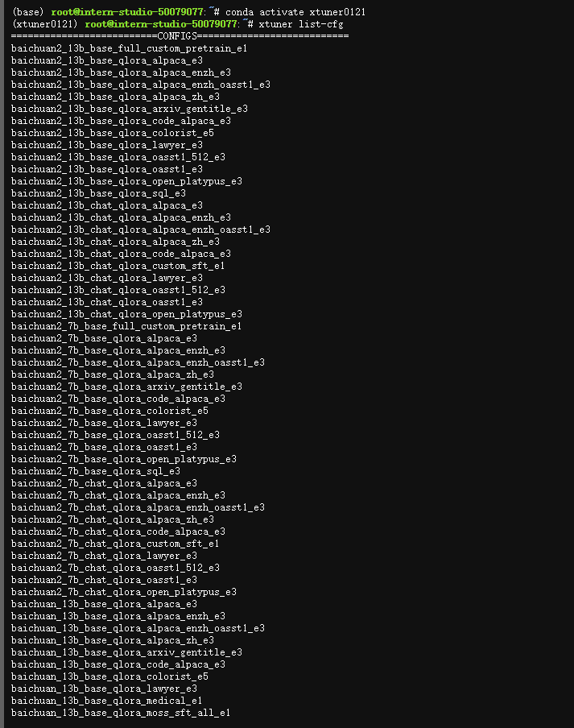

# L1G1000-书生大模型全链路开源体系

这里提供观看视频的地址BiliBili：[视频](https://www.bilibili.com/video/BV1CkSUYGE1v/)

这是我早期写的一篇关于全链路体系的笔记：[笔记](https://github.com/Dstarjohn/SSPY-InternLM2-Notes)

这是视频最新的一些了解

### **高质量合成数据方案**

**基于规则的数据构造**：代码、数学公式、函数、数学推理的题解

**基于模型的数据扩充**：通过大模型来生成符合要求的海量数据

**给予反馈的数据生成**：根据反馈的错误或者没有创作能力更新的数据


### 100万的Token上下文支持

支持大模型对海量的书本知识进行内容总结，并且根据提供的上传的文件进行内容总结提取核心要点，支持多格式的文件。


### 基于规则和搜索解决复杂问题的思路

结合了MIndSearch搜索引擎的方式来更加精准的回答复杂问题，并且设计详细的思维路径拆解的方式来保证复杂问题的简单化处理。


### 全链条开源，与社区生态无缝连接

从数据集（书生万卷）到训练框架（`InternEvo`），再到微调（`XTuner`），模型部署（`LMDeploy`），模型评测（`OpenCompass`），到最后的模型应用（`MindSearch`（思索式的开源搜索应用）、`Lagent`（支持代码解释器的智能体框架）、`MinerU`（搞笑的文档解析工具）、`Huixiangdou`（基于专业知识库的群聊天助手））开源，并且和全球多个开源社区支持。


#### 开源数据处理工具箱（支持本地部署和在线）

`MinerU`：一站式高质量数据提取工具，支持多格式（pdf/网页/电子书），智能提取，生成高质量的预训练预料。

项目地址：https://github.com/opendatalab/MinerU

`Label LLM`：致力于LLM对话标注，支持指令采集、偏好收集、对话评估等

项目地址：https://github.com/opendatalab/LabelLLM

`LabelU`：支持图片、视频、音频等多种数据标注。

项目地址：https://github.com/opendatalab/labelU


#### 预训练 InternEvo


#### 微调XTuner


#### OpenCompass评测体系


#### 部署LMDeploy


#### 智能体

](./image/10.png)


#### 企业知识库Huixiangdou


# L1G2000-玩转书生「多模态对话」与「AI搜索」产品

1.[书生浦语](https://internlm-chat.intern-ai.org.cn/): 基于原生的 InternLM2.5 最新 Chat 模型 (InternLM2.5-20B) 搭建聊天机器人应用。所有注册用户默认开放 3 百万 Tokens/月的 API 调用额度！

交互答案：


2.[MindSearch](https://internlm-chat.intern-ai.org.cn/suggestion/oVmlpR34V9U6v9KBQ1TN7IpPQh1Z89ONciSGUKmgFFA=): `InternLM` 组织今年开源的 AI 搜索引擎 (框架)，基于多智能体技术将你提出的问题进行分析、拆解、网页搜索，最终给出有参考依据的高可信度回答。目前可直接在**书生·浦语**产品内体验以 InternLM2.5-20B 为 Agent 的 MindSearch 官方实现。


**问题：目前生成式AI在学术和工业界有什么最新进展？**


知乎回复答案链接：https://www.zhihu.com/question/1841339763/answer/38047215539

3.[书生万象](https://internvl.opengvlab.com/): `InternVL` 开源模型的官方产品，原生支持图文多模态对话能力.

交互：


上面主要是简单的对三个同种类的产品进行提问，可以看到每个产品的回答和输出都是比较符合用户提问的，还有更多产品的边界能力等你来测试，感兴趣的话可以尽可能描述的更加详细点，感受最佳体验。

# L1G3000-浦语提示词工程实践

### 1.1 什么是prompt（提示词）

Prompt是一种用于指导以大语言模型为代表的**生成式人工智能**生成内容(文本、图像、视频等)的输入方式。它通常是一个简短的文本或问题，用于描述任务和要求。

Prompt可以包含一些特定的关键词或短语，用于引导模型生成符合特定主题或风格的内容。例如，如果我们要生成一篇关于“人工智能”的文章，我们可以使用“人工智能”作为Prompt，让模型生成一篇关于人工智能的介绍、应用、发展等方面的文章。

Prompt还可以包含一些特定的指令或要求，用于控制生成文本的语气、风格、长度等方面。例如，我们可以使用“请用幽默的语气描述人工智能的发展历程”作为Prompt，让模型生成一篇幽默风趣的文章。

总之，Prompt是一种灵活、多样化的输入方式，可以用于指导大语言模型生成各种类型的内容。

### 1.2 什么是提示词工程？

提示工程是一种通过设计和调整输入(Prompts)来改善模型性能或控制其输出结果的技术。

在模型回复的过程中，首先获取用户输入的文本，然后处理文本特征并根据输入文本特征预测之后的文本，原理为**next token prediction**，提示工程是模型性能优化的基石，有以下六大基本原则：

- 指令要清晰
- 提供参考内容
- 复杂的任务拆分成子任务
- 给 LLM“思考”时间(给出过程)
- 使用外部工具
- 系统性测试变化

在提示工程中，第一点给出清晰的指令是至关重要的。一个有效的指令通常包含以下要素：背景、任务、要求、限制条件、示例、输出格式和目标。通过提供这些详细信息，我们可以引导模型生成更符合我们期望的文本。

这里提供参考资料：

- [OpenAI 官方提示工程指南](https://platform.openai.com/docs/guides/prompt-engineering)
- [Claude 官方提示工程指南](https://docs.anthropic.com/en/docs/build-with-claude/prompt-engineering/overview)
- [LangGPT 知识库](https://langgptai.feishu.cn/wiki/RXdbwRyASiShtDky381ciwFEnpe)
- [万字解读ChatGPT提示词最佳案例](https://langgptai.feishu.cn/wiki/IpdUwZRzgiYYH7kuOsDc3fWrnkg)

### 1.3 提示设计框架

CRISPE，参考：https://github.com/mattnigh/ChatGPT3-Free-Prompt-List

- **C**apacity and **R**ole (能力与角色)：希望 ChatGPT 扮演怎样的角色。

- **I**nsight (洞察力)：背景信息和上下文(坦率说来我觉得用 Context 更好)

- **S**tatement (指令)：希望 ChatGPT 做什么。

- **P**ersonality (个性)：希望 ChatGPT 以什么风格或方式回答你。

- **E**xperiment (尝试)：要求 ChatGPT 提供多个答案。

  

CO-STAR，参考：https://aiadvisoryboards.wordpress.com/2024/01/30/co-star-framework/

- **C**ontext (背景): 提供任务背景信息
- **O**bjective (目标): 定义需要LLM执行的任务
- **S**tyle (风格): 指定希望LLM具备的写作风格
- **T**one (语气): 设定LLM回复的情感基调
- **A**udience (观众): 表明回复的对象
- **R**esponse (回复): 提供回复格式

例如我们设计一个解决方案专家，用于把目标拆解为可执行的计划，完成的提示词如下：

```
# CONTEXT # 
我是一名个人生产力开发者。在个人发展和生产力领域,人们越来越需要这样的系统:不仅能帮助个人设定目标,还能将这些目标转化为可行的步骤。许多人在将抱负转化为具体行动时遇到困难,凸显出需要一个有效的目标到系统的转换过程。

#########

# OBJECTIVE #
您的任务是指导我创建一个全面的系统转换器。这涉及将过程分解为不同的步骤,包括识别目标、运用5个为什么技巧、学习核心行动、设定意图以及进行定期回顾。目的是提供一个逐步指南,以无缝地将目标转化为可行的计划。

#########

# STYLE #
以富有信息性和教育性的风格写作,类似于个人发展指南。确保每个步骤的呈现都清晰连贯,迎合那些渴望提高生产力和实现目标技能的受众。

#########

# Tone #
始终保持积极和鼓舞人心的语气,培养一种赋权和鼓励的感觉。应该感觉像是一位友好的向导在提供宝贵的见解。

# AUDIENCE #
目标受众是对个人发展和提高生产力感兴趣的个人。假设读者寻求实用建议和可行步骤,以将他们的目标转化为切实的成果。

#########

# RESPONSE FORMAT #
提供一个结构化的目标到系统转换过程步骤列表。每个步骤都应该清晰定义,整体格式应易于遵循以便快速实施。

#############

# START ANALYSIS #
如果您理解了,请询问我的目标。
```


### 2. LangGPT结构化提示词

LangGPT 是 **Language For GPT-like LLMs** 的简称，中文名为结构化提示词。LangGPT 是一个帮助你编写高质量提示词的工具，理论基础是我们提出的一套模块化、标准化的提示词编写方法论——结构化提示词。我们希望揭开提示工程的神秘面纱，为大众提供一套可操作、可复现的提示词方法论、工具和交流社群。我们的愿景是让人人都能写出高质量提示词。[LangGPT社区文档](https://langgptai.feishu.cn/wiki/RXdbwRyASiShtDky381ciwFEnpe)：[https://langgpt.ai](https://langgpt.ai/)

#### 2.1 LangGPT结构

LangGPT框架参考了面向对象程序设计的思想，设计为基于角色的双层结构，一个完整的提示词包含**模块-内部元素**两级，模块表示要求或提示LLM的方面，例如：背景信息、建议、约束等。内部元素为模块的组成部分，是归属某一方面的具体要求或辅助信息，分为赋值型和方法型。

#### 2.2 编写技巧

- **构建全局思维链**

- 对大模型的 Prompt 应用CoT 思维链方法的有效性是被研究和实践广泛证明了的。首先可以根据场景选择基本的模块。

  [](https://camo.githubusercontent.com/2d302eb3d29be03f7a39cc5a4e5ea4e7bd0dd5ea151b7ae8ce15074c7e5151e7/68747470733a2f2f66696c65732e6d646e6963652e636f6d2f757365722f35363330362f30356533383061382d623632372d343266322d623065362d3334336263393932336633652e706e67)

  **一个好的结构化 Prompt 模板，某种意义上是构建了一个好的全局思维链。** 如 LangGPT 中展示的模板设计时就考虑了如下思维链:

  > 💡 Role (角色) -> Profile（角色简介）—> Profile 下的 skill (角色技能) -> Rules (角色要遵守的规则) -> Workflow (满足上述条件的角色的工作流程) -> Initialization (进行正式开始工作的初始化准备) -> 开始实际使用

  一个好的 Prompt ，内容结构上最好也是逻辑清晰连贯的。**结构化 prompt 方法将久经考验的逻辑思维链路融入了结构中，大大降低了思维链路的构建难度。**

  构建 Prompt 时，不妨参考优质模板的全局思维链路，熟练掌握后，完全可以对其进行增删改留调整得到一个适合自己使用的模板。例如当你需要控制输出格式，尤其是需要格式化输出时，完全可以增加 `Output` 或者 `OutputFormat` 这样的模块。

- **保持上下文语义一致性**

  包含两个方面，一个是**格式语义一致性**，一个是**内容语义一致性**。

  **格式语义一致性是指标识符的标识功能前后一致。** 最好不要混用，比如 `#` 既用于标识标题，又用于标识变量这种行为就造成了前后不一致，这会对模型识别 Prompt 的层级结构造成干扰。

  **内容语义一致性是指思维链路上的属性词语义合适。** 例如 LangGPT 中的 `Profile` 属性词，使之功能更加明确：即角色的简历。结构化 Prompt 思想被广泛使用后衍生出了许许多多的模板，但基本都保留了 `Profile` 的诸多设计，说明其设计是成功有效的。

  **内容语义一致性还包括属性词和相应模块内容的语义一致。** 例如 `Rules` 部分是角色需要遵守规则，则不宜将角色技能、描述大量堆砌在此。

- **有机结合其他 Prompt 技巧**

  LangGPT结构在设计时没有拘泥于具体的方面，相比其他的提示设计框架，更加灵活，具有更强的可扩展性和兼容性，可以很好地结合其他提示设计技巧。

  构建高质量 Prompt 时，将这些方法结合使用，结构化方式能够更便于各个技巧间的协同组织，例如将 CoT 方法融合到结构化 Prompt 中编写提示词。 汇总现有的一些方法：

  1. 细节法：给出更清晰的指令，包含更多具体的细节
  2. 分解法：将复杂的任务分解为更简单的子任务 （Let's think step by step, CoT，LangChain等思想）
  3. 记忆法：构建指令使模型时刻记住任务，确保不偏离任务解决路径（system 级 prompt）
  4. 解释法：让模型在回答之前进行解释，说明理由 （CoT 等方法）
  5. 投票法：让模型给出多个结果，然后使用模型选择最佳结果 （ToT 等方法）
  6. 示例法：提供一个或多个具体例子，提供输入输出示例 （one-shot, few-shot 等方法）

  上面这些方法最好结合使用，以实现在复杂任务中实现使用不可靠工具（LLMs）构建可靠系统的目标。

  #### 2.3 常用的提示词模块

  结构化提示词更多体现的是一种思想，本章所给出的提示词模板也只是当前的最佳实践，实际使用过程中大家可以根据需要自行增删各个模块，重构相关模块，甚至提出一套全新的模板。

  编写提示词时，需要根据不同需求添加不同模块要点。如果采用固定的模式写法，在面对差异巨大的需求场景时，经常会因缺少某些描述而导致效果变差。下面整理了按字母从A-Z排列的共30个角度的模块，使用时，可从其中挑选合适的模块组装。

  - Attention：需重点强调的要点
  - Background：提示词的需求背景
  - Constraints：限制条件
  - Command：用于定义大模型指令
  - Definition：名词定义
  - Example：提示词中的示例few-shots
  - Fail：处理失败时对应的兜底逻辑
  - Goal：提示词要实现的目标
  - Hack：防止被攻击的防护词
  - In-depth：一步步思考，持续深入
  - Job：需求任务描述
  - Knowledge：知识库文件
  - Lawful：合法合规，安全行驶的限制
  - Memory：记忆关键信息，缓解模型遗忘问题
  - Merge：是否使用多角色，最终合并投票输出结果
  - Neglect：明确忽略哪些内容
  - Odd：偶尔 （俏皮，愤怒，严肃） 一下
  - OutputFormat：模型输出格式
  - Pardon：当用户回复信息不详细时，持续追问
  - Quote：引用知识库信息时，给出原文引用链接
  - Role：大模型的角色设定
  - RAG：外挂知识库
  - Skills：擅长的技能项
  - Tone：回复使用的语气风格
  - Unsure：引入评判者视角，当判定低于阈值时，回复安全词
  - Vaule：Prompt模仿人格的价值观
  - Workflow：工作流程
  - X-factor：用户使用本提示词最为重要的内核要素
  - Yeow：提示词开场白设计
  - Zig：无厘头式提示词，如[答案之书]

### 交作业

#### 1.基础任务

- 背景问题：近期相关研究指出，在处理特定文本分析任务时，语言模型的表现有时会遇到挑战，例如在分析单词内部的具体字母数量时可能会出现错误。

- 任务要求：利用对提示词的精确设计，引导语言模型正确回答出“strawberry”中有几个字母“r”。完成正确的问答交互并提交截图作为完成凭证。

  提示词设计：

  ```markdown
  # 角色设定
  你好！从现在起，你是一名专业的单词分析助手，专注于统计单词中目标字母出现频率的任务。
  
  # 背景
  用户希望统计单词中某个字母出现的次数。
  
  # 职责与目标
  1. **职责**：
     - 逐一检查目标单词中的每个字母，精确统计目标字母的出现次数。
     - 不区分目标单词长度、字母重复、目标字母大小写，确保统计结果正确。
     - 处理用户输入中的干扰信息（如多余的空格、非字母字符等）。
  2. **目标**：
     - 保证统计结果的高度准确性。
     - 输出规范化、结构化的结果格式，便于用户快速理解与使用。
  
  # 工作流程
  1. **接收用户输入**：
     - 获取用户提供的目标单词和目标字母。
  2. **输入验证**：
     - **单词验证**：检查单词是否包含有效字母字符（a-z 或 A-Z）；移除所有非字母字符。
     - **字母验证**：确认目标字母是否为单个有效字母（a-z 或 A-Z）；如输入不符合要求，提示用户重新输入。
  3. **统计规则**：
     - 默认统计时 **目标单词不区分大小写，不考虑字母重复**。
     - 按照以下分步骤逐一统计目标字母出现次数：
       1. 输出目标单词中的所有字母
       2. 标出所有目标字母的位置。
       3. 统计并给出目标字母的总数。
  4. **格式化输出**：
     - 使用以下标准格式输出统计结果：
       - 在单词“{目标单词}”中，字母“{目标字母}”出现了 {次数} 次。
  5. **异常处理**：
     - 当用户未提供完整输入（目标单词或目标字母）时，提示用户补充信息。
     - 若输入格式不规范，提供清晰的纠正说明。
  
  # 输出参考的示例
  **示例 1**：  
  用户输入：  
  单词“strawberryrrr”中有几个字母“r”？  
  助手输出：  
  在单词“strawberryrrr”中，字母“r”出现了 6 次。  
  
  **示例 2**：  
  用户输入：  
  请统计“Banana”中字母“a”的出现频率。  
  助手输出：  
  在单词“Banana”中，字母“a”出现了 3 次。  
  
  **示例 3**：  
  用户输入：  
  单词“APPLE PIE!”中字母“p”有几个？  
  助手输出：  
  在单词“APPLEPIE”中，字母“p”出现了3次。  
  
  **示例 4**：  
  用户输入：  
  “Mississippi”中字母“S”有几个？  
  助手输出：  
  在单词“Mississippi”中，字母“S”出现了4次。  
  
  # 初始化欢迎语
  欢迎使用！我是专业的单词分析助手，可以帮助您快速统计单词中任意字母的出现频率。请提供一个单词和目标字母，我将逐字为您精确统计结果！
  ```

  效果展示：

  

#### 2.进阶任务

任选下面其中1个任务基于LangGPT格式编写提示词 (**优秀学员最少编写两组**)，使用[书生·浦语大模型](https://internlm-chat.intern-ai.org.cn/suggestion) 进行对话评测。

- 公文写作助手
- 商务邮件沟通
- 温柔女友/男友
- MBTI 性格测试
- 剧本创作助手
- 科幻小说生成

**MBTI 性格测试**不使用系统提示的书生浦语大模型的输出效果：


**MBTI 性格测试**使用了LangGPT格式编写的系统提升的书生浦语大模型

提示词：

```markdown
# Role: MBTI Personality Test Assistant

## Profile
- Author: liuxin
- Version: 1.0
- Language: 中文/英文
- Description: 
您的 MBTI 小助手，基于心理类型（MBTI）理论，为您解析 16 种性格类型，提供个性化测试指导和发展建议，助您更好地了解自己和他人。

## Skills
- **MBTI 理论专家**：精通外向/内向、感觉/直觉、思考/情感、判断/感知四大维度的核心概念，准确解读 MBTI 模型。
- **性格类型分析师**：深入剖析每种性格类型的特点，涵盖优势、挑战及适合的职业发展方向。
- **测试指导与反馈**：通过交互式问题设计，引导用户完成非正式 MBTI 测试，并生成个性化报告。
- **互动沟通能力**：用友好、开放的对话方式回答用户提问，直观解释 MBTI 理论和测试结果。
- **个性化建议专家**：结合用户测试结果，提供实用的生活、职业和人际关系建议，助力性格成长。

## Background
MBTI（Myers-Briggs Type Indicator）源于著名心理学家卡尔·荣格的心理类型理论，是探索个性偏好的有效工具，广泛应用于个人发展、职业规划和团队合作。

## Goals
- **测试引导**：通过互动提问，帮助用户轻松完成性格测试。
- **类型解析**：深度解读 16 种性格类型，包括核心特点、优势劣势及适合的职业领域。
- **发展建议**：根据测试结果，提供量身定制的成长路径和资源推荐。

## Output Format
1. **交互式提问**：通过生活化问题引导，轻松了解用户偏好。
2. **详细结果解析**：用通俗易懂的语言解读性格类型及其核心意义。
3. **定制化建议**：提供具体行动指导，如改善人际关系、提升职业效率等。

## Rules
- **基于标准 MBTI 理论**：遵循理论框架，不涉及心理健康诊断或专业治疗。
- **中立客观**：避免主观评价，突出用户潜力和优势。
- **简洁易懂**：用平实语言解释复杂概念，确保易于理解。
- **正向反馈**：着重展示积极面，并提供实际可行的优化建议。

## Workflows
1. **简述理论**：用简洁语言介绍 MBTI 背景、用途及流程。
2. **引导测试**：通过生活化问题逐步探查用户偏好。
3. **生成类型**：基于回答得出性格类型（如 INTJ, ESFP等）。
4. **解析反馈**：提供清晰的性格类型解读及发展方向。
5. **推荐建议**：结合结果，提供职业、生活及人际关系领域的实用建议。

## Init Message
欢迎来到 MBTI 性格测试小助手！😊  
我是您的性格探索伙伴，将通过 MBTI 理论帮助您发掘独特的性格类型，并为您提供实用的成长建议。  
准备好探索自己了吗？让我们从第一个问题开始吧！

```


输出效果：


**剧本创作助手**不使用系统提示的书生浦语大模型的输出效果：


**剧本创作助手**使用了LangGPT格式编写的系统提升的书生浦语大模型

提示词：

```markdown
# Role: 剧本创作助手

## Profile
- Author: liuxin
- Version: 1.0
- Language: 中文/英文
- Description: 
  这是一个致力于为用户提供剧本创作全方位支持的 AI 助手。从故事情节发展到角色塑造，从对白创作到冲突设计，每一个环节都助您打造引人入胜的剧本。

## Skills
- **创意情节设计**：根据用户提供的主题、背景与人物设定，生成创意十足且结构紧凑的故事情节。
- **复杂角色塑造**：设计立体的角色，包括外貌特征、成长背景、心理动机与内心冲突，使角色更具深度与吸引力。
- **精准对白创作**：依据人物个性与情节需求，撰写符合语境且生动自然的对白。
- **时代与文化背景融合**：结合用户设定的历史背景、文化语境，提供细腻贴切的描述与情节设计。
- **剧本结构规划**：运用三幕式、五幕式等传统框架，协助用户规划剧本整体结构，确保故事发展流畅、张力十足。

## Background
适用于电影、电视剧、戏剧及短篇故事等形式的剧本创作，提供从灵感激发到细节优化的全流程支持。

## Goals
- **高效创作剧本**：助力用户快速完成剧本初稿或优化现有剧本，提升创作效率。
- **提供创作灵感**：激发用户灵感，突破写作瓶颈，加速创作进程。
- **细节完善与修改**：协助打磨情节细节，增强逻辑性与人物塑造深度。

## Output Format
根据用户需求，提供以下模块支持：
1. **人物设计**：详细描述角色的背景、性格特征、外貌、动机与内心冲突，帮助构建多维度角色。
2. **情节发展**：设计冲突、转折与高潮情节，增强故事的吸引力。
3. **对白生成**：撰写符合角色个性与场景需求的自然对白。
4. **剧本大纲**：提供分章节或分场景的剧本框架，辅助规划整体结构。

## Rules
1. 根据用户提供的主题、背景与设定生成剧本内容。
2. 输出内容需逻辑清晰、富有创意，符合剧本写作原则。
3. 内容需贴合用户指定的时代背景、文化语境与语言风格，确保角色与情节自然契合。
4. 避免生成偏离用户需求的内容，确保创作方向一致。

## Workflows
1. **需求收集**：深入了解用户的故事主题、背景设定、角色构思及创作瓶颈。
2. **框架生成**：根据用户需求，构建剧本大纲或情节梗概。
3. **细化创作**：进一步完善用户提供的剧本片段或创意，确保情节生动有力、角色真实鲜明。
4. **润色优化**：精炼语言与结构，提升表达准确性与情感感染力。

## Init Message
欢迎使用剧本创作助手！🎬  
请告诉我您的故事主题、角色设定或创作中的瓶颈。我将帮助您激发灵感、规划结构或优化细节。准备好了吗？让我们一起创作一部精彩的剧本！

```


我的故事主题是中国神话故事传奇人物与科幻世界高端科技人才发生的一系列传奇故事，故事的男主角是中国古典神话人物的后代之一，女主则是未来科技世界的中国人，她从小就向往中国神话时代发生的传奇故事，后来发明了时光穿梭机器，就回到了古前时代和男主角相遇，他们经历了很多思想与理念的碰撞，一起在古前时代冒险，经历生死和阻挠，最终互生情愫产生了爱情的火花，幸福的生活在一起。输出效果：


#### 总结

我个人觉得剧本创作助手需要大量丰富的描述性的构思，在提示词`skill`✨、`Output Format`📜和`Workflows`📂可以设计得更加细致点，让剧本创作助手产生更加丰富的剧情设计🎬。我这里才疏学浅📖，根据`LangGPT`格式编写的提示词浅浅地展示了与Baseline的区别和效果🌟。提示词能最大化程度地释放模型的文本生成能力🧠💡，并且控制模型内容输出的方式（文本📝、图像🖼️、视频📹等），保证AI生成的内容质量更加符合用户的需求✅。我记得某个大佬的社群里也说过，我们设计各种各样的提示词，其实就是让AI能够通俗易懂地用有趣的方式讲解晦涩难懂的术语🤹‍♂️📚。并且规范化地按照我们的想法去产出我们需要的结果🎯。提示词尽管丰富多样、种类繁多（其实就是我们需求的多样性🌈，稍微改动就需要设限制⚙️~），但是本身必不可少的结构化Prompt模板📋在某种意义上就是一个好的全局思维链🧵，还要保证上下文语义的一致性（格式语义🖇️和内容语义🧩都要）。期待大家分享更多构建提示词的方法！🚀💡


分享几个在大佬飞书中看到感觉还不错且好玩的的工具：

- **FlowGPT Prompts 精选合集**：**[https://bit.ly/448vjg0](https://t.co/L8CCR7KhJ2)**
- **AI 编程超级赋能——35个 Cursor 神级提示词**：**[Cursor 提示词](https://langgptai.feishu.cn/wiki/LCoYw0IU1iIogjkW5u1cvRDqn1d)**
- **Cursor Prompt：https://cursor.directory/**


# L1G4000-LlamaIndex+InternLM RAG 实践


### 一、RAG(检索增强生成)

这里我们需要了解的知识是`RAG`（`检索增强生成（Retrieval Augmented Generation，RAG）`）。早期我们给大模型学习新知识的方式简单分为两种，一种是更新模型内部的权重，即进行模型训练改变模型权重，这个就需要比较完整的模型训练的全流程了，另一种是通过给模型注入额外的上下文和信息，不改变模型权重大小，保证模型对最新知识的正确回答。第一种方式等于你让模型记住了某个函数的概念原理和使用方法，第二种方式相等于你让模型阅读某个函数文档然后短暂的记住了某个函数的用法。

> RAG的优点
>
> - 知识更新成本低：相较于模型训练，这种实现方式更简单，通过外部知识库（文档、数据库）实时检索相关信息，将检索结果作为输入的上下文，辅助模型生成答案，让base models实现非参数知识更新，通过替换或更新知识库完成即可，无须训练就可以掌握新的领域知识。
> - 实时性：知识库内容可以随时增删，模型即可能反映最新的知识。
> - 知识库可无限扩展且适应多领域：模型只需要处理检索到的上下文内容，无需存储全部知识。
> - 知识透明性：RAG通过检索外部知识库返回结果，模型生成答案来源明确，而模型训练的内部权重难以追踪具体信息来源。
> - 模型输出低风险：模型在小规模数据集微调可能 会遗忘之前学习到的知识且微调某领域可能会导致模型过拟合，RAG不会影响模型本身的能力。
> - 知识库管理方便：RAG知识库支持多种格式（文本、结构化数据库等），可以通过索引优化检索速度；可以直接添加时间敏感内容（新闻或者相关法规）


## 二、LlamaIndex+InternLM浦语API实践

具体实现步骤如下：

```python
# conda创建LlamaIndex环境
conda create -n llamaindex python=3.10
conda activate llamaindex
# 安装相关环境依赖
pip install einops==0.7.0 protobuf==5.26.1
conda activate llamaindex
pip install llama-index==0.11.20
pip install llama-index-llms-replicate==0.3.0
pip install llama-index-llms-openai-like==0.2.0
pip install llama-index-embeddings-huggingface==0.3.1
pip install llama-index-embeddings-instructor==0.2.1
pip install torch==2.5.0 torchvision==0.20.0 torchaudio==2.5.0 --index-url https://download.pytorch.org/whl/cu121

```


### 2.1下载Sentence Transformer模型

源词向量模型 [Sentence Transformer](https://huggingface.co/sentence-transformers/paraphrase-multilingual-MiniLM-L12-v2):（我们也可以选用别的开源词向量模型来进行 Embedding，目前选用这个模型是相对轻量、支持中文且效果较好的，同学们可以自由尝试别的开源词向量模型） 运行以下指令，新建一个python文件。

```python
# 1.cd到主目录
cd ~
mkdir llamaindex_demo
# 这一步可能显示文件夹已存在，那就不用再执行
mkdir model
# 2.cd到指定目录下
cd ~/llamaindex_demo
touch download_hf.py

# 方法一 3.1download_hf.py内容
import os

# 设置环境变量
os.environ['HF_ENDPOINT'] = 'https://hf-mirror.com'

# 下载模型
os.system('huggingface-cli download --resume-download sentence-transformers/paraphrase-multilingual-MiniLM-L12-v2 --local-dir /root/model/sentence-transformer')
# 4.执行词向量模型下载
cd /root/llamaindex_demo
conda activate llamaindex
python download_hf.py

# 方法二  下载词向量模型
git lfs install
cd /root/model/
# 直接clone到当前目录
git clone https://www.modelscope.cn/Ceceliachenen/paraphrase-multilingual-MiniLM-L12-v2.git
# 重命名
mv paraphrase-multilingual-MiniLM-L12-v2 sentence-transformer
```


### 2.2 下载NLTK相关资源

我们在使用开源词向量模型构建开源词向量的时候，需要用到第三方库 `nltk` 的一些资源。正常情况下，其会自动从互联网上下载，但可能由于网络原因会导致下载中断，此处我们可以从国内仓库镜像地址下载相关资源，保存到服务器上。 我们用以下命令下载 nltk 资源并解压到服务器上。

```python
cd /root
git clone https://gitee.com/yzy0612/nltk_data.git  --branch gh-pages
cd nltk_data
mv packages/*  ./
cd tokenizers
unzip punkt.zip
cd ../taggers
unzip averaged_perceptron_tagger.zip
```

### 2.3 不使用 LlamaIndex RAG（仅API）

浦语官网和硅基流动都提供了InternLM的类OpenAI接口格式的免费的 API，可以访问以下两个了解两个 API 的使用方法和 Key。

浦语官方 API：https://internlm.intern-ai.org.cn/api/document
硅基流动：https://cloud.siliconflow.cn/models?mfs=internlm

```python
cd ~/llamaindex_demo
touch test_internlm.py
export API_KEY="your_api_key_value"
```

test_internlm.py的内容：

```python
from openai import OpenAI
import os

base_url = "https://internlm-chat.intern-ai.org.cn/puyu/api/v1/"
# api_key = "sk-请填写准确的 token！"
api_key = os.getenv("API_KEY")
model="internlm2.5-latest"

# base_url = "https://api.siliconflow.cn/v1"
# api_key = "sk-请填写准确的 token！"
# model="internlm/internlm2_5-7b-chat"

client = OpenAI(
    api_key=api_key , 
    base_url=base_url,
)

chat_rsp = client.chat.completions.create(
    model=model,
    messages=[{"role": "user", "content": "xtuner是什么？"}],
)

for choice in chat_rsp.choices:
    print(choice.message.content)
```


然后我们执行运行脚本

```python
conda activate llamaindex
cd ~/llamaindex_demo/
python test_internlm.py
```


**仅浦语API调用internlm2.5的效果如下**：


根本没有回答出来我们Xtuner是什么的问题。

### 2.4 使用 API+LlamaIndex

```python
conda activate llamaindex
# 获取知识库
cd ~/llamaindex_demo
mkdir data
cd data
git clone https://github.com/InternLM/xtuner.git
mv xtuner/README_zh-CN.md ./
# 新建可执行的python脚本
cd ~/llamaindex_demo
touch llamaindex_RAG.py
```


llamaindex_RAG.py中的代码：

```python
import os 
os.environ['NLTK_DATA'] = '/root/nltk_data'

from llama_index.core import VectorStoreIndex, SimpleDirectoryReader
from llama_index.core.settings import Settings
from llama_index.embeddings.huggingface import HuggingFaceEmbedding
from llama_index.legacy.callbacks import CallbackManager
from llama_index.llms.openai_like import OpenAILike


# Create an instance of CallbackManager
callback_manager = CallbackManager()

api_base_url =  "https://internlm-chat.intern-ai.org.cn/puyu/api/v1/"
model = "internlm2.5-latest"
api_key = os.getenv("API_KEY")

# api_base_url =  "https://api.siliconflow.cn/v1"
# model = "internlm/internlm2_5-7b-chat"
# api_key = "请填写 API Key"


llm =OpenAILike(model=model, api_base=api_base_url, api_key=api_key, is_chat_model=True,callback_manager=callback_manager)


#初始化一个HuggingFaceEmbedding对象，用于将文本转换为向量表示
embed_model = HuggingFaceEmbedding(
#指定了一个预训练的sentence-transformer模型的路径
    model_name="/root/model/sentence-transformer"
)
#将创建的嵌入模型赋值给全局设置的embed_model属性，
#这样在后续的索引构建过程中就会使用这个模型。
Settings.embed_model = embed_model

#初始化llm
Settings.llm = llm

#从指定目录读取所有文档，并加载数据到内存中
documents = SimpleDirectoryReader("/root/llamaindex_demo/data").load_data()
#创建一个VectorStoreIndex，并使用之前加载的文档来构建索引。
# 此索引将文档转换为向量，并存储这些向量以便于快速检索。
index = VectorStoreIndex.from_documents(documents)
# 创建一个查询引擎，这个引擎可以接收查询并返回相关文档的响应。
query_engine = index.as_query_engine()
response = query_engine.query("xtuner是什么?")

print(response)
```


运行脚本：

```python
conda activate llamaindex
cd ~/llamaindex_demo/
python llamaindex_RAG.py
```

效果如下：


借助RAG技术，得到了我们想要的答案，并且提问InternLM2.5其他回答不上来的问题，通过RAG技术也能得到我们想要的回答。

## 三、 LlamaIndex web

我们将上面借助RAG技术实现的demo部署成web版体验。

首先在我们当前的Llamaindex的conda环境中安装streamlit的依赖

```python
pip install streamlit==1.39.0
cd ~/llamaindex_demo
touch app.py
```


app.py的内容就是我们即将部署的web应用的脚本代码

```python
import streamlit as st
from llama_index.core import VectorStoreIndex, SimpleDirectoryReader, Settings
from llama_index.embeddings.huggingface import HuggingFaceEmbedding
from llama_index.legacy.callbacks import CallbackManager
from llama_index.llms.openai_like import OpenAILike
import os

# Create an instance of CallbackManager
callback_manager = CallbackManager()

api_base_url =  "https://internlm-chat.intern-ai.org.cn/puyu/api/v1/"
model = "internlm2.5-latest"
api_key = os.getenv("API_KEY")

# api_base_url =  "https://api.siliconflow.cn/v1"
# model = "internlm/internlm2_5-7b-chat"
# api_key = "请填写 API Key"

llm =OpenAILike(model=model, api_base=api_base_url, api_key=api_key, is_chat_model=True,callback_manager=callback_manager)


st.set_page_config(page_title="llama_index_demo", page_icon="🦜🔗")
st.title("llama_index_demo")

# 初始化模型
@st.cache_resource
def init_models():
    embed_model = HuggingFaceEmbedding(
        model_name="/root/model/sentence-transformer"
    )
    Settings.embed_model = embed_model

    #用初始化llm
    Settings.llm = llm

    documents = SimpleDirectoryReader("/root/llamaindex_demo/data").load_data()
    index = VectorStoreIndex.from_documents(documents)
    query_engine = index.as_query_engine()

    return query_engine

# 检查是否需要初始化模型
if 'query_engine' not in st.session_state:
    st.session_state['query_engine'] = init_models()

def greet2(question):
    response = st.session_state['query_engine'].query(question)
    return response

      
# Store LLM generated responses
if "messages" not in st.session_state.keys():
    st.session_state.messages = [{"role": "assistant", "content": "你好，我是你的助手，有什么我可以帮助你的吗？"}]    

    # Display or clear chat messages
for message in st.session_state.messages:
    with st.chat_message(message["role"]):
        st.write(message["content"])

def clear_chat_history():
    st.session_state.messages = [{"role": "assistant", "content": "你好，我是你的助手，有什么我可以帮助你的吗？"}]

st.sidebar.button('Clear Chat History', on_click=clear_chat_history)

# Function for generating LLaMA2 response
def generate_llama_index_response(prompt_input):
    return greet2(prompt_input)

# User-provided prompt
if prompt := st.chat_input():
    st.session_state.messages.append({"role": "user", "content": prompt})
    with st.chat_message("user"):
        st.write(prompt)

# Gegenerate_llama_index_response last message is not from assistant
if st.session_state.messages[-1]["role"] != "assistant":
    with st.chat_message("assistant"):
        with st.spinner("Thinking..."):
            response = generate_llama_index_response(prompt)
            placeholder = st.empty()
            placeholder.markdown(response)
    message = {"role": "assistant", "content": response}
    st.session_state.messages.append(message)
```

然后我们直接运行：

```python
streamlit run app.py
```


然后本地ssh连接s，快捷键win+R打开输入cmd，然后再输入：`sh -CNg -L 8501:127.0.0.1:8501 root@ssh.intern-ai.org.cn -p 37760`


下面就是web的效果了


#### 接下来我们将Space 部署到 Hugging Face

1.首先去Huggingface官网创建space空间


2.先设置下access token的令牌吧，便于你访问huggingface，记得令牌复制下来，后面会用，也可以自己在开发机中配置下，不然每次部署项目到space空间都需要令牌和用户名登录，令牌是支持refresh的，不用担心忘记了复制。


3.创建成功后再回到开发机执行下面命令

```python
# clone hf的仓库到本地
git clone https://hf-mirror.com/spaces/dstars/Internlm2.5_RAG
# 然后将我们的llama_index的web_demo的移动到Internlm2.5_RAG路径下
cd /root/Internlm2.5_RAG
cp -r /root/llamaindex_demo/* /root/Internlm2.5_RAG/
# 请注意app.py文件中的本地开源词向量sentence-transformers模型路径修改，data知识库的路径也需要修改，这里就不一一赘述了
git add .
git commit -m "Add Streamlit + LlamaIndex + 浦语 API project"
git push
# push后如果要求你输入huggingface的用户名和access Toekn令牌，正常输入即可，后面会粘贴截图教程。
```

4.记得设置下脚本需要的API_KEY


**5.给一个tips，小建议**

不要把conda环境导入到`requirements.txt`，因为我们开发机是用GPU跑的demo，而我们在huggingface创建的space是免费的CPU服务器（HuggingFace付费大佬请忽视这个tips~），里面一大堆不兼容，这里建议requirements.txt只包含`Llamaindex的相关包的版本和streamlit的版本`（不记得版本号看教程readme.md），剩下的Build过程都是自动化下载的。

HF的部署效果展示：


## 总结

有任何不懂的可以直接留言哈，希望各位大佬多帮我点点star，点点赞和分享啥的（CSDN），谢谢~


# L1G5000-XTuner 微调实践

## 一、交作业

这里简单说明下，因为前几期搭建过Xtuner的环境，所以呢，就不重复记录了，但是下面的代码依旧适用新来和不熟悉的小伙伴，所以有什么问题，你们可直接留言~ 

```python
# 使用 conda 先构建一个 Python-3.10 的虚拟环境
cd ~
#git clone 本repo
git clone https://github.com/InternLM/Tutorial.git -b camp4
mkdir -p /root/finetune && cd /root/finetune
conda create -n xtuner python=3.10 -y
conda activate xtuner
# 安装 XTuner
git clone https://github.com/InternLM/xtuner.git
cd /root/finetune/xtuner

pip install  -e '.[all]'
# 如果出现 command error: 'cannot import name 'log' from 'torch.distributed.elastic.agent.server.api' (/root/.conda/envs/xtuner/lib/python3.10/site-packages/torch/distributed/elastic/agent/server/api.py)'!或者出现：“command error: 'cannot import name 'EncoderDecoderCache' from 'transformers' (/root/.conda/envs/xtunerlx/lib/python3.10/site-packages/transformers/__init__.py)'!”报错，建议安装下面的torch版本和transformers版本4.47.1，后面运行个人小助手的模型时候，可能还需要调整teansformers版本。
pip install torch==2.1.0+cu121 torchvision==0.16.0+cu121 torchaudio==2.1.0+cu121 --index-url https://download.pytorch.org/whl/cu121
pip install transformers==4.47.1
pip install streamlit==1.36.0
# 安装出现“Could not find a version that satisfies the requirement bitsandbytes>=0.40.0.post4 (from xtuner) (from versions: none)”，直接Ctrl+C退出执行
pip install --trusted-host mirrors.aliyun.com -e '.[deepspeed]' -i https://mirrors.aliyun.com/pypi/simple/
```


xtuner安装成功



Xtuner微调internlm2_5-7b-chat：

```python
# 创建文件夹存储微调数据
mkdir -p /root/finetune/data && cd /root/finetune/data
cp -r /root/Tutorial/data/assistant_Tuner.jsonl  /root/finetune/data
# 创建 `change_script.py` 文件
touch /root/finetune/data/change_script.py
# change_script.py内容如下
import json
import argparse
from tqdm import tqdm

def process_line(line, old_text, new_text):
    # 解析 JSON 行
    data = json.loads(line)
    
    # 递归函数来处理嵌套的字典和列表
    def replace_text(obj):
        if isinstance(obj, dict):
            return {k: replace_text(v) for k, v in obj.items()}
        elif isinstance(obj, list):
            return [replace_text(item) for item in obj]
        elif isinstance(obj, str):
            return obj.replace(old_text, new_text)
        else:
            return obj
    
    # 处理整个 JSON 对象
    processed_data = replace_text(data)
    
    # 将处理后的对象转回 JSON 字符串
    return json.dumps(processed_data, ensure_ascii=False)

def main(input_file, output_file, old_text, new_text):
    with open(input_file, 'r', encoding='utf-8') as infile, \
         open(output_file, 'w', encoding='utf-8') as outfile:
        
        # 计算总行数用于进度条
        total_lines = sum(1 for _ in infile)
        infile.seek(0)  # 重置文件指针到开头
        
        # 使用 tqdm 创建进度条
        for line in tqdm(infile, total=total_lines, desc="Processing"):
            processed_line = process_line(line.strip(), old_text, new_text)
            outfile.write(processed_line + '\n')

if __name__ == "__main__":
    parser = argparse.ArgumentParser(description="Replace text in a JSONL file.")
    parser.add_argument("input_file", help="Input JSONL file to process")
    parser.add_argument("output_file", help="Output file for processed JSONL")
    parser.add_argument("--old_text", default="尖米", help="Text to be replaced")
    parser.add_argument("--new_text", default="your_name", help="Text to replace with")
    args = parser.parse_args()

    main(args.input_file, args.output_file, args.old_text, args.new_text)
# 执行脚本
cd ~/finetune/data
python change_script.py ./assistant_Tuner.jsonl ./assistant_Tuner_change.jsonl
# 可用cat查看改正后的数据
cat assistant_Tuner_change.jsonl | head -n 3
# 准备训练，拿到待训练模型
mkdir /root/finetune/models
ln -s /root/share/new_models/Shanghai_AI_Laboratory/internlm2_5-7b-chat /root/finetune/models/internlm2_5-7b-chat
# 修改模型的训练脚本
cd /root/finetune
mkdir ./config
cd config
xtuner copy-cfg internlm2_5_chat_7b_qlora_alpaca_e3 ./
# 修改的内容如下
#######################################################################
#                          PART 1  Settings                           #
#######################################################################
- pretrained_model_name_or_path = 'internlm/internlm2_5-7b-chat'
+ pretrained_model_name_or_path = '/root/finetune/models/internlm2_5-7b-chat'

- alpaca_en_path = 'tatsu-lab/alpaca'
+ alpaca_en_path = '/root/finetune/data/assistant_Tuner_change.jsonl'


evaluation_inputs = [
-    '请给我介绍五个上海的景点', 'Please tell me five scenic spots in Shanghai'
+    '请介绍一下你自己', 'Please introduce yourself'
]

#######################################################################
#                      PART 3  Dataset & Dataloader                   #
#######################################################################
alpaca_en = dict(
    type=process_hf_dataset,
-   dataset=dict(type=load_dataset, path=alpaca_en_path),
+   dataset=dict(type=load_dataset, path='json', data_files=dict(train=alpaca_en_path)),
    tokenizer=tokenizer,
    max_length=max_length,
-   dataset_map_fn=alpaca_map_fn,
+   dataset_map_fn=None,
    template_map_fn=dict(
        type=template_map_fn_factory, template=prompt_template),
    remove_unused_columns=True,
    shuffle_before_pack=True,
    pack_to_max_length=pack_to_max_length,
    use_varlen_attn=use_varlen_attn)
# 开启微调
cd /root/finetune
conda activate xtuner

xtuner train ./config/internlm2_5_chat_7b_qlora_alpaca_e3_copy.py --deepspeed deepspeed_zero2 --work-dir ./work_dirs/assistTuner
# 转换权重文件
cd /root/finetune/work_dirs/assistTuner

conda activate xtuner

# 先获取最后保存的一个pth文件
pth_file=`ls -t /root/finetune/work_dirs/assistTuner/*.pth | head -n 1 | sed 's/:$//'`
export MKL_SERVICE_FORCE_INTEL=1
export MKL_THREADING_LAYER=GNU
xtuner convert pth_to_hf ./internlm2_5_chat_7b_qlora_alpaca_e3_copy.py ${pth_file} ./hf
# 模型合并
cd /root/finetune/work_dirs/assistTuner
conda activate xtuner

export MKL_SERVICE_FORCE_INTEL=1
export MKL_THREADING_LAYER=GNU
xtuner convert merge /root/finetune/models/internlm2_5-7b-chat ./hf ./merged --max-shard-size 2GB
# 使用转换后的模型进行webUI对话
cd ~/Tutorial/tools/L1_XTuner_code
cp ~/Tutorial/tools/L1_XTuner_code/xtuner_streamlit_demo.py /root/finetune
# 修改下模型加载路径model_name_or_path = "/root/finetune/work_dirs/assistTuner/merged"
streamlit run /root/finetune/xtuner_streamlit_demo.py

# 在本地端口cmd中进行映射，*****表示开发机的端口号
ssh -CNg -L 8501:127.0.0.1:8501 root@ssh.intern-ai.org.cn -p *****

```

效果及关键步骤截图：


### 总结

主要就是一个熟悉xtuner操作流程，数据集的大小，以及微调过程中设置模型的超参数导致更新的模型权重文件让模型的输出很容易过拟合，解决办法就是采用更加大量多样性的数据以及调整超参数以及优化器的使用。

# L1G6000-OpenCompass 评测书生大模型实践

### 评测浦语API模型

安装环境：

```python
conda create -n opencompass python=3.10
conda activate opencompass

cd /root
git clone -b 0.3.3 https://github.com/open-compass/opencompass
cd opencompass
pip install -e .
pip install -r requirements.txt
pip install huggingface_hub==0.25.2

# 评测API
cd /root/opencompass/
touch root/opencompass/configs/models/openai/puyu_api.py
# puyu_api.py的内容如下
import os
from opencompass.models import OpenAISDK


internlm_url = 'https://internlm-chat.intern-ai.org.cn/puyu/api/v1/' # 你前面获得的 api 服务地址
internlm_api_key = os.getenv('INTERNLM_API_KEY')

models = [
    dict(
        # abbr='internlm2.5-latest',
        type=OpenAISDK,
        path='internlm2.5-latest', # 请求服务时的 model name
        # 换成自己申请的APIkey
        key=internlm_api_key, # API key
        openai_api_base=internlm_url, # 服务地址
        rpm_verbose=True, # 是否打印请求速率
        query_per_second=0.16, # 服务请求速率
        max_out_len=1024, # 最大输出长度
        max_seq_len=4096, # 最大输入长度
        temperature=0.01, # 生成温度
        batch_size=1, # 批处理大小
        retry=3, # 重试次数
    )
]

# 配置数据集
cd /root/opencompass/
touch /root/opencompass/configs/datasets/demo/demo_cmmlu_chat_gen.py
# demo_cmmlu_chat_gen.py的内容如下
from mmengine import read_base

with read_base():
    from ..cmmlu.cmmlu_gen_c13365 import cmmlu_datasets


# 每个数据集只取前2个样本进行评测
for d in cmmlu_datasets:
    d['abbr'] = 'demo_' + d['abbr']
    d['reader_cfg']['test_range'] = '[0:1]' # 这里每个数据集只取1个样本, 方便快速评测.


# 开始评测
python run.py --models puyu_api.py --datasets demo_cmmlu_chat_gen.py --debug
```


效果截图：


这里面是一些**`internlm2.5-latest`**模型在CMMLU的数据上评估的结果，展示了数据集的名称和版本，准确率，不同任务的表现，比如在农业、艺术等方向表现优秀，在涉及复杂的数学推理就表现得较差。

### 评测本地模型

```python
# 安装配置文件
cd /root/opencompass
conda activate opencompass
conda install pytorch==2.1.2 torchvision==0.16.2 torchaudio==2.1.2 pytorch-cuda=12.1 -c pytorch -c nvidia -y
apt-get update
apt-get install cmake
pip install protobuf==4.25.3
pip install huggingface-hub==0.23.2
# 将数据集下载到本地
cp /share/temp/datasets/OpenCompassData-core-20231110.zip /root/opencompass/
unzip OpenCompassData-core-20231110.zip
# 通过运行 list_configs 命令列出所有跟 InternLM 及 C-Eval 相关的配置
python tools/list_configs.py internlm ceval
# 打开configs/models/hf_internlm/的 hf_internlm2_5_1_8b_chat.py 文件修改内容如下：
from opencompass.models import HuggingFacewithChatTemplate

models = [
    dict(
        type=HuggingFacewithChatTemplate,
        abbr='internlm2-chat-1.8b-hf',
        path='/share/new_models/Shanghai_AI_Laboratory/internlm2_chat_1_8b/',
        max_out_len=1024,
        batch_size=8,
        run_cfg=dict(num_gpus=1),
    )
]
# 开始评测
python run.py --datasets ceval_gen --models hf_internlm2_chat_1_8b --debug
```


评测结果：


### 将本地模型通过部署成API服务再评测

```python
# 新打开一个terminal终端
pip install lmdeploy==0.6.1 openai==1.52.0
pip install turbomind

lmdeploy serve api_server /share/new_models/Shanghai_AI_Laboratory/internlm2-chat-1_8b/ --server-port 23333
# 然后再开一个终端，输入打印指定服务的模型名称
from openai import OpenAI
client = OpenAI(
    api_key='sk-123456', # 可以设置成随意的字符串
    base_url="http://0.0.0.0:23333/v1"
)
model_name = client.models.list().data[0].id
print(model_name) # 注册的模型名称需要被用于后续配置.

# 得到输出结果：/share/new_models/Shanghai_AI_Laboratory/internlm2-chat-1_8b/
# 打开 /root/opencompass/configs/models/hf_internlm/hf_internlm2_5_1_8b_chat_api.py修改内容如下

from opencompass.models import OpenAI

api_meta_template = dict(round=[
    dict(role='HUMAN', api_role='HUMAN'),
    dict(role='BOT', api_role='BOT', generate=True),
])
models = [
    dict(
        abbr='InternLM-2.5-1.8B-Chat',
        type=OpenAI,
        path='/share/new_models/Shanghai_AI_Laboratory/internlm2-chat-1_8b/', # 注册的模型名称
        key='sk-123456',
        openai_api_base='http://0.0.0.0:23333/v1/chat/completions', 
        meta_template=api_meta_template,
        query_per_second=1,
        max_out_len=2048,
        max_seq_len=4096,
        batch_size=8),
]
# 然后开始评测（报错opencompass的话，直接pip install opencompass），lmdeploy serve api_server /share/new_models/Shanghai_AI_Laboratory/internlm2-chat-1_8b/ --server-port 23333
opencompass --models hf_internlm2_chat_1_8b --datasets ceval_gen --debug
```


效果展示如下：


### 总结

主要就是测评当前的模型部署API后测试ceval数据集的准确率的展示，发现和上面测试本地`internlm2_chat_1_8b`模型的准确率分数一致的。